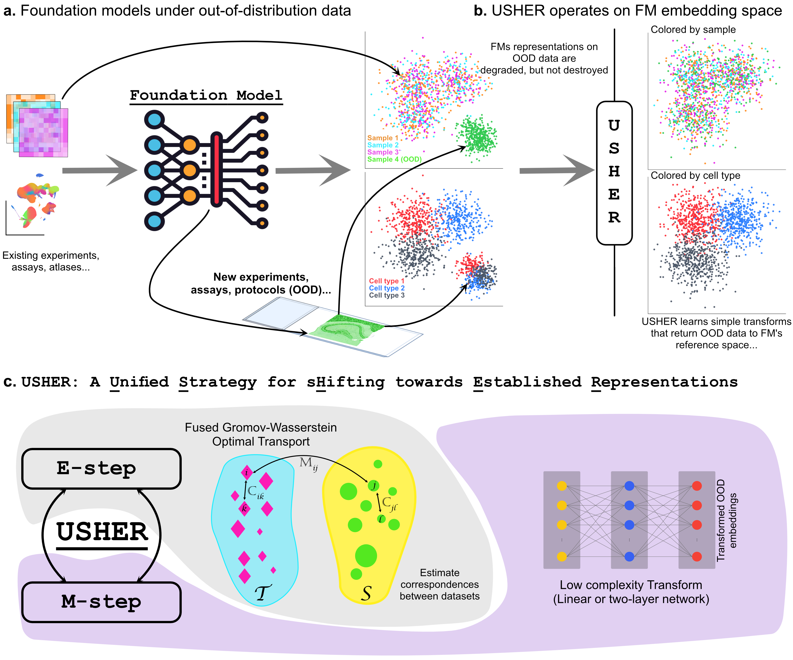

# USHER: A Unified Strategy for Shifting Towards Established Representations in Foundation Models

A comprehensive toolkit for adapting out-of-distribution data to foundation models through linear optimal transport.

## Overview

USHER enables foundation models to process diverse, out-of-distribution data sources without retraining or fine-tuning. Instead of modifying the model, USHER learns interpretable linear transformations that shift new data distributions towards the established representations that foundation models expect. This approach preserves model integrity while expanding their operational scope.

## Key Features

- **Multiple alignment methods**: Optimal Transport (OT), Gromov-Wasserstein (GW), Fused Gromov-Wasserstein (FGW)
- **Spatial windowing**: Memory-efficient processing of large spatial datasets
- **Distribution matching**: Sliced Wasserstein Distance (SWD) and Maximum Mean Discrepancy (MMD) for improved alignment
- **GPU acceleration**: Full PyTorch implementation with CUDA support
- **Flexible metrics**: Support for both cosine and Euclidean distance metrics

## Example Notebook

For a complete walkthrough, see the [scGPT example notebook](example_notebooks/scGPT_example.ipynb) which demonstrates aligning Xenium spatial transcriptomics data to scRNA-seq using scGPT embeddings.

## Citation

If you use this code, please cite: Pratapa, A., Tata, P. R., & Singh, R. (2025). **USHER: Guiding Foundation Model Representations through Distribution Shifts**.  *bioRxiv*. Cold Spring Harbor Laboratory. DOI: [10.1101/2025.11.20.689462](https://doi.org/10.1101/2025.11.20.689462)

## License

CC BY NC SA 4.0

This work is licensed under the Creative Commons Attribution-NonCommercial-ShareAlike 4.0 International License. To view a copy of this license, visit http://creativecommons.org/licenses/by-nc-sa/4.0/ or send a letter to Creative Commons, PO Box 1866, Mountain View, CA 94042, USA.

## Contact

For questions and issues, please open an issue on GitHub or contact the maintainers.
